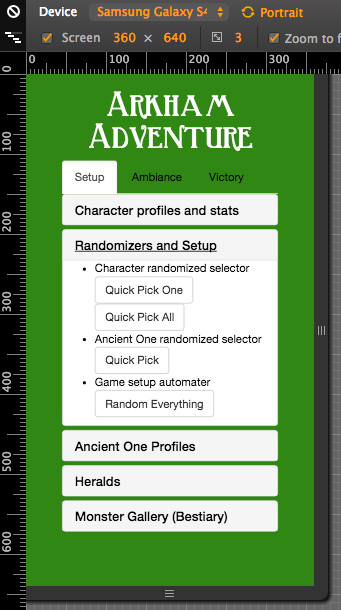
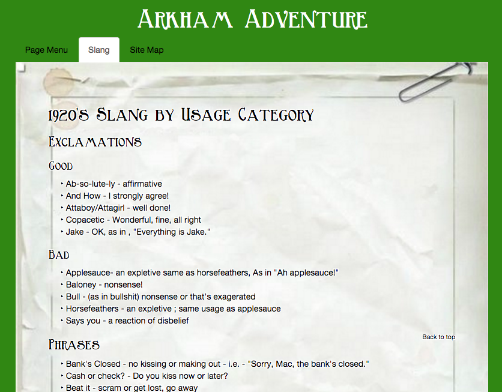
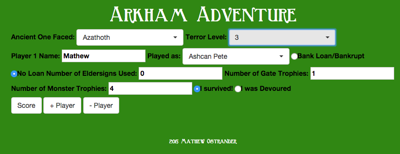
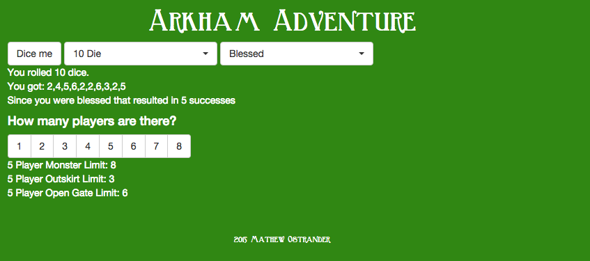

# ArkhamAdventure
Creating a site to enhance the ambiance of Arkham Horror

Installing and Using:

-As it is, this uses require to handle all the dependencies. As such, just loading it as a scriptless html page won't work.

-If you want to play around with the current features you will have to clone or fork the repository and run it on a local server from your command-line/terminal

-If you don't know how to run an http-server, I would recommend using npm to install one following the instructions [Here](https://www.npmjs.com/package/http-server).

-After the server is installed just run it in your terminal and open the local-host at the port you specified.

Planned Features (by Priority):
Setup (Before the game begins)

	1. Character profiles and stats

	2. Character randomized selector

	3. Ancient One randomized selector

	4. Game setup automater

	5. Ancient One profiles and stats

	6. Heralds

	7. Monster Gallery (Bestiary)

Ambiance (During the game)

	1. Slang of the era

	2. Music playlist to set the mood

	3. Soundboard of effects

	4. Randomized dice and widgets

	5. Monster limits and open gate limits based on number of players

	6. Game-state trackers

Victory (After the game)

	1. Score Tally

	2. Game stats gallery

These priorities also serve as the basic guideline for menu functionality. Upon completion of all this an API may be developed and implemented in order to include items, locations, mythos, and other game pieces.

The current site will be redesigned to be a mobile first site using Bootstrap to handle the spacing and menus.

The majority of the 1920's slang was obtained from http://local.aaca.org/bntc/slang/slang.htm

In progress: Tally score based on in game actions

Done: Roll dice and view game limits based on players

Update 2/21/16:
This is/was one of my earliest forays into html/javascript and I initially bit off more than I can chew. While I was still in the middle of changing the site design and layout I ended up learning some different technologies that made me want to try and develop this as a phone app first, then a website second.

Currently more work is being done on a refactored version of this repo:

https://github.com/MAOstrander/Arkham-Adventure-App/
